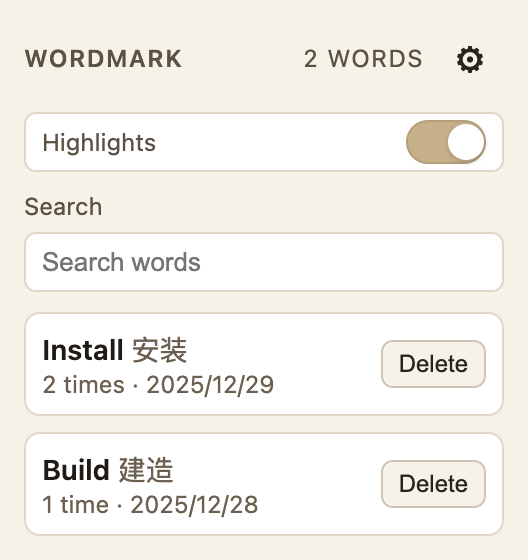
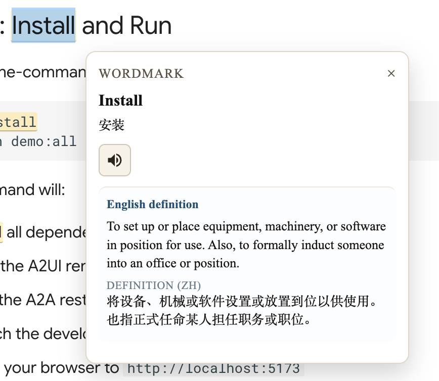

# WordMark (Browser Extension)

Vocabulary lookup and highlighting extension for Chromium-based browsers.

## What it does
- Lookup overlay for selected words, with pronunciation and optional translation.
- Popup word list with search/delete and highlight toggle.
- Shortcut support: assign a browser command (default suggested `Alt+W`) in your browser’s shortcut settings. Options page provides a direct “Go to shortcut settings” button.
- Optional translation (Gemini) when an API key is provided in Options.

## Getting started
1) Install dependencies: `npm install`  
2) Build: `npm run build` (outputs to `dist/`)  
3) Load unpacked extension from the `dist/` folder in your browser.  
4) After install, Options will open automatically. Click “Go to shortcut settings” to assign the command, then (optionally) add your translation API key.

## Screenshots

  

  
  

## Development
- Build: `npm run build`
- Test: `npm test`
- Lint: `npm run lint`

## Browsers
- Chromium/Chrome: shortcut settings at `chrome://extensions/shortcuts`
- Microsoft Edge: shortcut settings at `edge://extensions/shortcuts`

## License
PolyForm Noncommercial License 1.0.0 — noncommercial use only. For commercial licensing, contact the author.
