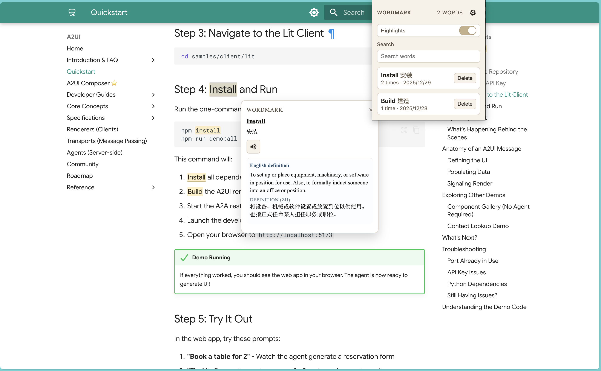
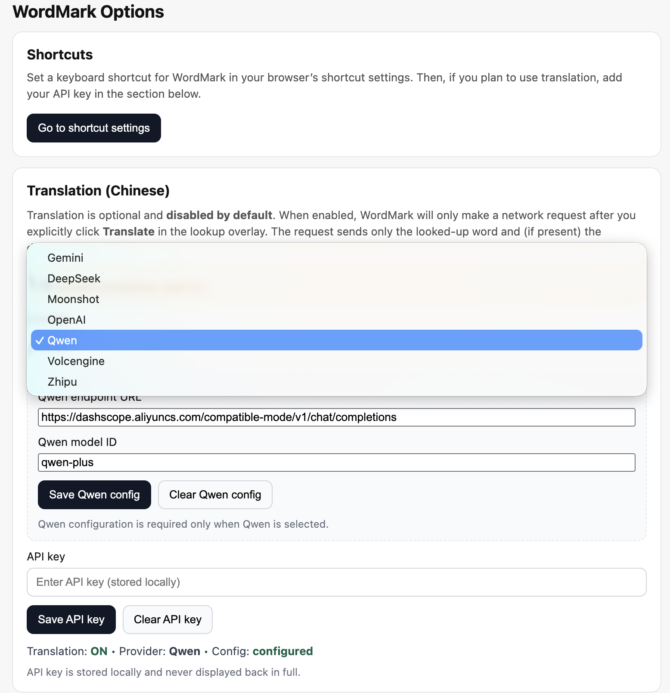

# WordMark (Browser Extension)

Vocabulary lookup and highlighting extension for Chromium-based browsers.

## What it does
- Lookup overlay for selected words, with pronunciation and optional translation.
- Popup word list with search/delete and highlight toggle.
- Shortcut support: assign a browser command (default suggested `Alt+W`) in your browser’s shortcut settings. Options page provides a direct “Go to shortcut settings” button.
- Optional translation when a provider API key is configured in Options.

Supported translation providers:
- Gemini
- DeepSeek
- Moonshot
- OpenAI
- Qwen
- Volcengine
- Zhipu

## Install
- Chrome Web Store: [WordMark](https://chromewebstore.google.com/detail/wordmark/gkbncpcicoicipfhpdiommlhppjboaim?hl=zh-CN)

## Getting started
1) Install dependencies: `npm install`  
2) Build: `npm run build` (outputs to `dist/`)  
3) Load unpacked extension from the `dist/` folder in your browser.  
4) After install, Options will open automatically. Click “Go to shortcut settings” to assign the command, then (optionally) configure translation.

## Configuration
Translation is opt-in and disabled by default. To enable it:
1) Open Options and turn on “Enable translation (opt-in)”.
2) Select a provider.
3) Save the provider API key.
4) For providers that require it, also save the endpoint URL and model ID.

Notes:
- API keys are stored per provider. Clearing the key only affects the currently selected provider.
- Gemini endpoint/model overrides are optional; leave them empty to use the built-in endpoints and automatic model selection.
- DeepSeek, Moonshot, OpenAI, Qwen, Volcengine, and Zhipu require endpoint URL + model ID to be set.

## Screenshots

  

  
  

  

## Development
- Build: `npm run build`
- Test: `npm test`
- Lint: `npm run lint`

## Browsers
- Chromium/Chrome: shortcut settings at `chrome://extensions/shortcuts`
- Microsoft Edge: shortcut settings at `edge://extensions/shortcuts`

## License
PolyForm Noncommercial License 1.0.0 — noncommercial use only. For commercial licensing, contact the author.
